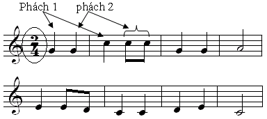
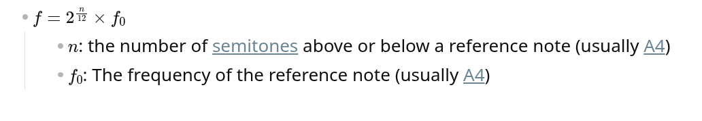

# Âm nhạc là gì?
Ta có thể hiểu đơn giản như sau: Âm nhạc là sự diễn biến theo thời gian của âm thanh
thanh

# 1. Đặc tính của âm nhạc
Âm nhạc có 2 đặc tính chính: "Tính trường độ" và "tính cao độ"

## 1.1 Tính trường độ
- Đã bao giờ bạn nghe 1 bài hát và "nhịp" chân theo bài hát đó chưa? Đó chính là nhịp
- Thực ra trong âm nhạc, người ta dùng chữ "nhịp" như là đơn vị đo thời gian cơ bản. Nó chính là khoảng thời gian đều đặn nhau giữa các âm thanh, mà trong các bài hát hầu hết được duy trì bởi tiếng trống

- Nhịp trong tiếng anh là "beat", và để đo 1 bài hát nhanh hay chậm, người ta đếm số nhịp trong 1 phút, hay còn gọi là beat per minute, hay là bpm. bpm càng cao nghĩa là bài hát càng nhanh
  - Ví du:
    - Through the Fire and Flames cuả Dragon Force có bpm là 200 (https://tunebat.com/Info/Through-The-Fire-And-Flames-DragonForce/1UMdbkqX19OiwfExH7gzYA)
    - Lover của Taylor Swift có bpm là 69 (https://tunebat.com/Info/Lover-Taylor-Swift/1dGr1c8CrMLDpV6mPbImSI)

- Từ khái niệm nhịp, người ta có "ô nhịp", "tiết nhịp", "phách", và "tiết tấu"
- "Ô nhịp" là 1 đơn vị thời gian chứa 1 vài "nhịp", và được thể hiện bằng "tiết nhịp"
- Đã có bao giờ bạn nhìn vào 1 bản nhạc và để ý thấy chúng được chia thành những ô khá đều nhau, và có 2 số trông giống như phân số như thế này chưa

Những ô đều nhau đó gọi là "Ô nhịp", và phân số đó gọi là "tiết nhịp" (trong tiếng anh gọi là time signature)

### Vậy bạn đọc "tiết nhịp" như thế nào?
Hãy đọc nó như 1 phân số! Nhịp 4/4 nghĩa là 4 x 1/4, nghĩa là trong 1 ô nhịp, xuất hiện 4 nhịp, và mỗi nhịp có giá trị là 1/4

Vậy nốt 1/4 là nốt gì? đó chính là nốt đen

Âm nhạc quốc tế có 1 hệ quy chuẩn về trường độ như sau:
- Nốt tròn = whole note = ronde = semibrve = 1
- Nốt trắng = half note = 1/2
- Nốt đen = quarter note = crotchet = 1/4
- Nốt móc đơn = eighth note = 1/8
- Nốt móc kép = sixteenth note = 1/16

### Phách
- Trong 1 ô nhịp chia ra nhiều đơn vị nhỏ đều nhau, đó chính là phách
- Vậy phách tương ứng với 1 nhịp
- Phách mạnh thường nằm ở đầu ô nhịp, đến phách mạnh vừa, phách nhẹ. Đây là lý do 1 bài hát mà có trống thì sẽ dễ duy trì được nhịp hơn, vì người ta biết khi nào sẽ bắt đầu 1 ô nhịp mới

### Tiết tấu
- Tiết tấu là sự tương quan trường độ giữa các thanh âm nối tiếp nhau.
- Các khái niệm nốt tròn, nốt trắng, nốt đen,... và tiết nhịp đều có thể xem thuộc về tiết tấu của bài hát

## 1.2 Tính cao độ
1 bài hát sẽ có lúc "lên cao", và có lúc "xuống thấp", thì nó mới tạo ra được giai điệu!
Về vật lý, cao độ chính là tần số rung động của dây đàn guitar. 1 dây rung với tần số càng cao thì âm thanh phát ra càng cao

Trong cao độ người ta hay nói về "quãng"

### Quãng và Quãng hòa âm
- Quãng là khoảng cách về cao độ của 2 nốt nhạc
nhạc
- Khi 2 nốt phát ra cùng lúc, người ta gọi đó là Quãng hòa âm

### Quy chuẩn về cao độ
- Trong âm nhạc, người ta quy định các nốt ứng với các tần số (frequency) nhất định. Nếu bạn đã học vật lý 12 thì có thể sẽ còn nhớ công thức tính cao độ của các note
- Ở đây trích dẫn lại công thức cho vui thôi, chứ thực ra chúng ta không cần nhớ đến tần số quá chi tiết như vậy, vì ngày nay có vô vàn ứng dụng giúp bạn có thể đo được cao độ của 1 note

