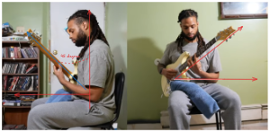

# Spider Walk
- Ý tưởng của bài tập này là tập cho ngón tay có 1 độ cong nhất định, như vậy thì tay bạn sẽ không chạm vào dây khác trong quá trình chơi (và làm dây bị chạm vào không vang được)

- Bạn có thể bắt đầu ở bất kì vị trí nào, dùng hết 4 ngón tay ấn các fret tăng dần.
- Bắt đầu từ bpm nhỏ, tăng dần, tới khi đạt 80bpm
- Backing track có thể dùng drum machine ở đây: https://www.musicca.com/drum-machine#data=40-n-44-a--5acegikmo6em7ai-

## Lưu ý quan trọng:
1. Chỉ khi nào tới lượt ngón tay cần di chuyển thì mới di chuyển, nếu không thì hãy cố gắng giữ ngón tay ở vị trí nó đang ở. Việc này giúp ngón tay của bạn sẽ được điều chỉnh để có 1 độ cong nhất định.

2. Cố gắng giữ các đầu ngón tay vuông góc với mặt đàn

3. Nếu được hãy cố gắng giữ đàn ở tư thế này, sẽ giúp đỡ mỏi cổ/vai gáy nếu phải tập luyện lâu. 
   - Nhìn trực diện thì góc cổ đàn chếch lên, lý tưởng là 45 độ.
   - Nhìn từ phương thằng đứng xuống, cổ đàn tạo với vai 1 góc 45 độ

## Video tập luyện
- https://youtu.be/kiBFQ9QBCM0