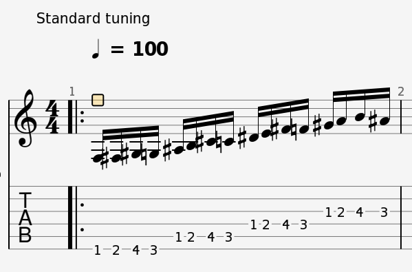
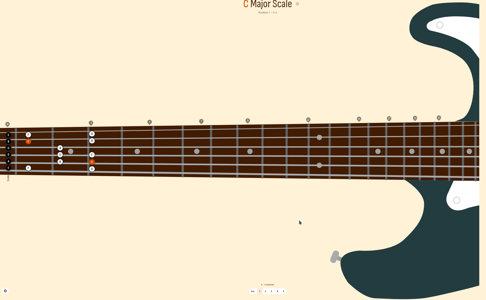

# Guitar tab

Không giống như piano, nơi mà mỗi phím đàn tại 1 vị trí chỉ có thể tương ứng với 1 và chỉ 1 nốt, 1 nốt nhạc có nhiều cách chơi trên guitar (Ví dụ nốt C4 có thể chơi ở ngăn 8 dây 6, hoặc ở ngăn 3 của dây 5), vì vậy việc nhìn những nốt nhạc và chơi trực tiếp đòi hỏi kĩ năng phải biết nốt nhạc nằm ở đâu trên cần đàn, và chơi như thế nào cho thuận tay.

Kĩ năng này có thể nói là khá khó, và thường khi trình diễn thì người ta phụ thuộc vào tri nhớ cơ bắp (muscle memory) hơn là việc nhìn bản nhạc và chơi trực tiếp, vì vậy cộng đồng guitar đã có 1 cách giúp những người mới có thể tiếp cận với việc chơi đàn như thế nào, đó là guitar tab

Guitar tab là 1 bản đồ của 6 dây đàn, và vị trí tương ứng cần phải bấm trên phím đàn để phát ra nốt mong muốn. Như vậy nó giống như là 1 bản đồ cho cơ bắp, giúp bạn giảm bớt 1 phân đoạn phải chuyển từ nốt nhạc thành các vị trí trên cần đàn

Đây là 1 ví dụ của tab guitar. bạn sẽ tháy nó có 6 dòng kẻ, mỗi dòng kẻ tương ứng với 1 dây đàn
Dòng kẻ dưới cùng đại diện cho dây E thấp. Bạn cứ tưởng tượng bạn đặt guitar như vị trí trong hình và nhìn vào, thì 6 dòng kẻ tương ứng với 6 dây đàn, và số trên mỗi dây tương ứng với vị trí bạn cần ấn ở dây đó

## Mở tab guitar như thế nào
Trong cộng đồng guitar, có 1 phần mềm cực kì thông dụng, là guitar pro.
Hầu hết tab guitar đều được lưu dưới định dạng của phần mềm này, đuôi file là `.gp`

Nên để mở 1 file tab đuôi là `.gp`, bạn có thể dùng phần mềm này
Nếu bạn không có phần mềm này trên máy tính, bạn có thể download tab về máy tính, và dùng web này để đọc: https://gprotab.net/

## Các nguồn phụ lục bổ ích khác
- Khi bạn muốn tìm hợp âm cho 1 bài hát, bạn có thể dùng https://hopamchuan.com/ cho các bài nhạc Việt
- Bạn có thể dùng https://www.cifraclub.com cho nhạc US-UK, thậm chí có nhiều bài hát của các nước khác như Tây Ban Nha, Brazil v, .v..

## Tab cho exercise Spider Walk 1
- Ở bài [3](./3.first_exercise_spider_walk.md), đã có đề cập bài tập Spider Walk 1, đây là [Link tới tab Spider Walk 1](../exercise/spirder_walk_1.gp)
- Bạn có thể tải file này về, rồi dùng phần mềm guitar pro hoặc https://gprotab.net/ để mở.
- Với website, bạn không thể thay đổi file, nên nếu muốn chơi chậm hơn có thể dùng biểu tượng đồng hồ góc trên tay phải giảm xuống còn 50%