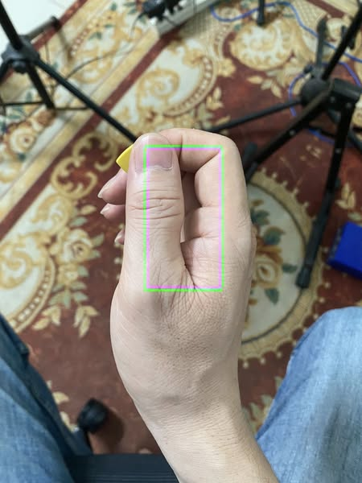

# Exercise 2 - String permutation
- Tương tự như bài 1, nhưng bài tập này không chơi theo tuần tự mà đổi thứ tự 2 nốt cuối
- Bài tập này giúp ngón áp út và ngón út độc lập với nhau hơn
- Tab: [String Permutation](../exercise/string_permutation.gp)

## Tay phải
- ở bài tập này, ta dùng tay phải như 1 phím gảy, lên xuống đều đặn, nốt đầu tiên là chuyển động gảy xuống

## Cách cầm phím

Nếu không có phím thì có thể dùng phần móng của ngón trỏ như 1 cái phím

## Video hướng dẫn
- https://youtu.be/v7PrL9oh5Wo