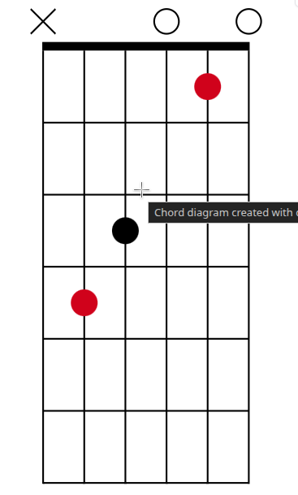

# Hợp âm hình C

- 1 trong những thế tay cơ bản của guitar là hợp âm hình C
- Mặc dù trên cần đàn người ta có thể chơi hợp âm C ở rất nhiều vị trí khác nhau, nhưng khi nói đến hình C, thường đây là vị trí mọi người quen thuộc nhất

- Hình dáng: 

- Tab: [C shape chord](../exercise/c_shape_chord.gp)
- Video: https://youtu.be/0yid9IATC6M
