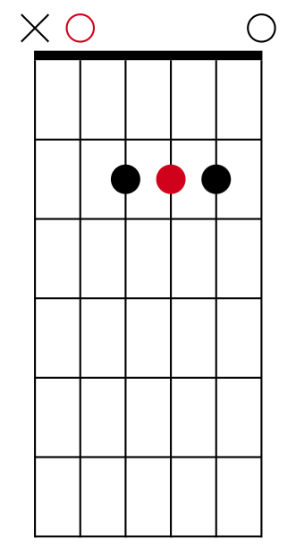
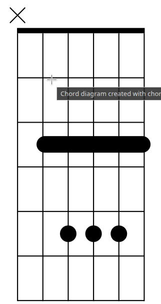

# Hợp âm hình A

- 1 trong những thế tay cơ bản của guitar là hợp âm hình A
- Mặc dù trên cần đàn người ta có thể chơi hợp âm A ở rất nhiều vị trí khác nhau, nhưng khi nói đến hợp âm A, thường đây là vị trí mọi người quen thuộc nhất

- Hình dáng hợp âm A trưởng: 
- Nốt màu đỏ là Root note. Trong trường hợp này là nốt C (Đô)

- Tab: [A shape chord](../exercise/A_shape_chord.gp)

## Ta có thể chơi hợp âm C dùng shape A không?
- Hoàn toàn có thể
- Ta biét C = A + 3 semitone, vậy chỉ cần dời vị trí A lên 3 ngăn sẽ được hợp âm C

- Tab [C chord A shape](../exercise/c_chord_a_shape.gp)